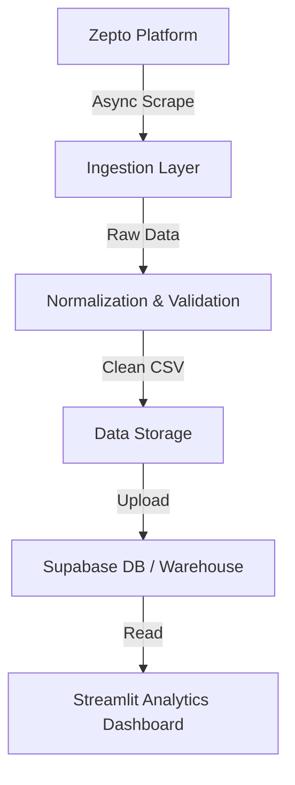

# 🛒 Zepto Scraper & Data Pipeline


> **Production‑style data pipeline to scrape, validate, and store Zepto product & pricing data for analytics.**  
> Designed with interview‑ready architecture, failure handling, and scalability in mind.

---

## 🚀 Why this project matters

This project demonstrates **real‑world data engineering skills**, not just scraping:
- **Resilient Ingestion:** Async architecture using `playwright` for fast, parallel data extraction.
- **Reliability:** Handles anti-bot measures, network interception for RSC (React Server Components), and DOM fallbacks.
- **Analytics Ready:** Extracts products, prices, inventory, and delivery ETAs, normalizing them for downstream BI.
- **Dashboarding:** Integrated Streamlit dashboard for real-time visibility into pricing and availability.

---

## 🧠 High‑Level Architecture



**Key idea:** Scraping is **decoupled** from storage and analytics.

---

## 📂 Repository Structure

The project follows a modular, production-grade structure:

```text
zepto-scraper-pipeline/
├── src/
│   ├── scrapers/          # Core scraping logic (ZeptoScraper)
│   ├── dashboard/         # Streamlit analytics dashboard
│   └── database.py        # Database connection layer
├── scripts/               # Runnable entry points
│   ├── run_zepto.py       # Single instance runner
│   ├── run_zepto_assortment_parallel.py # Parallel batch ingestion
│   └── ...
├── data/
│   ├── input/             # Pincode lists and config files
│   └── output/            # Scraped CSVs and performance reports
└── docs/                  # Project documentation
```

---

## ⚙️ Tech Stack

| Layer | Technology |
|-----|-----------|
| **Language** | Python 3.10+ |
| **Ingestion** | Playwright (Async) |
| **Orchestration** | Python Asyncio |
| **Storage** | CSV (Intermediate), Supabase (PostgreSQL) |
| **Visualization** | Streamlit |
| **Version Control** | Git + GitHub |

---

## ▶️ Setup & Usage

### 1. Installation
```bash
git clone <repo_url>
cd scraper_zepto
pip install -r requirements.txt
playwright install
```

### 2. Configuration
Copy `.env.example` to `.env` and configure your credentials.
```bash
cp .env.example .env
```

### 3. Running the Pipeline
**Bulk Ingestion (Parallel):**
```bash
python scripts/run_zepto_assortment_parallel.py
```
*Reads pincodes from `data/input/pin_codes.xlsx` and saves results to `data/output/`.*

### 4. Running the Dashboard
```bash
streamlit run src/dashboard/app_zepto.py
```

---

## 📌 Resume‑Ready Highlights

- **Built a production‑style data ingestion pipeline** handling thousands of SKUs.
- **Designed modular architecture** separating ingestion, processing, and visualization.
- **Implemented rigorous error handling** with retries, logging, and performance metrics.
- **Created real-time analytics** to visualize assortment gaps and pricing trends.

---

## 👤 Author

**Ajitvir Singh**  
Data Engineering | Analytics | Systems Thinking
